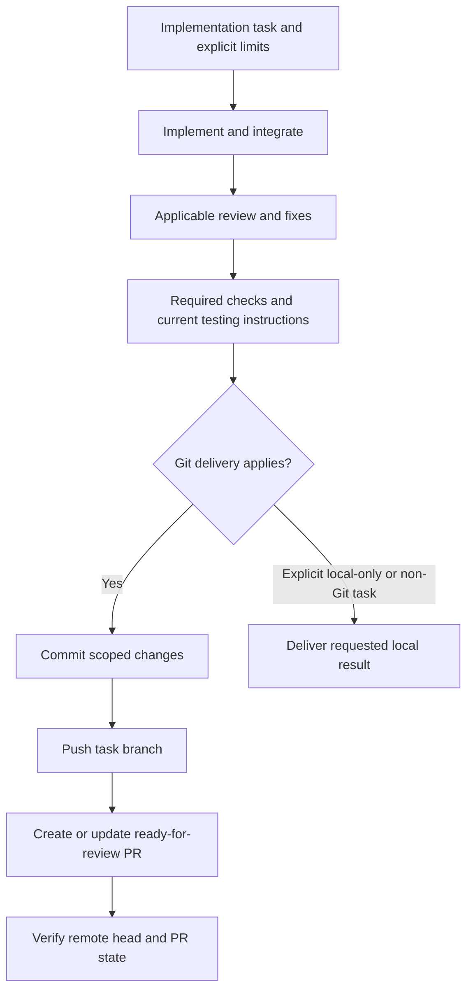

# Git delivery and definition of done

For implementation work in a Git repository, AgentKit's default deliverable includes a scoped commit, a push to the intended delivery remote, and a ready-for-review pull request. A request to implement a feature, fix, configuration change, repository asset, or documentation update using this workflow includes those delivery steps; do not stop after local edits or ask for separate confirmation of each ordinary Git step.

Explicit task restrictions take precedence, including local-only work, no commit/push/PR, no remote mutations, and a request for a patch or proposal only. Review-only, research, architecture/planning-only, and release-readiness assessments keep their existing report-only scope. Non-Git artifact work does not require creating a repository or remote. This default does not authorize merging or approving a PR, deploying, publishing a release or external content, marking a tracker item Done, force-pushing, or discarding unrelated work.

## One delivery owner

The coordinator owns Git delivery after integrating the specialists' work, resolving required review findings, completing applicable checks, and finalizing the [testing handoff](testing-handoff.md). Delegated specialists return their scoped changes and evidence; they do not independently commit, push, or create PRs unless the coordinator explicitly assigns that ownership. A directly invoked specialist without a coordinator owns delivery for its task. A specialist's completion checkpoint is an intermediate handoff; it is not a claim that the whole implementation is delivered.

## Deliver the final change

1. Inspect the repository instructions, current branch, working tree and index, commit identity, intended remote, base branch, and any existing PR. Apply the [tooling and credential policies](tooling-and-credentials.md), existing repository conventions, and task restrictions. Reuse known authorization rather than requesting it again. Do not change account configuration or retrieve new credentials merely because delivery is the next step.
2. Use a suitable existing task branch or create a `codex/` branch by default, following an explicit user or repository branch convention. Keep the default/protected branch as the PR base. Establish the intended remote and base from repository evidence; use `origin` when it is the intended destination. Do not infer permission to push directly to the base branch, overwrite a conflicting branch, or create a new remote repository.
3. Inspect the final diff and stage only the task's changes. Preserve unrelated working-tree and staged content, including another worker's edits. Exclude credentials, local runtime state, temporary reports, test fixtures, and generated scratch files unless the task explicitly delivers them. Run applicable final checks; a new change invalidates only affected prior evidence.
4. Commit the reviewed task changes with a description of the resulting behavior, then push the task branch without rewriting published history. If hooks or remote checks fail, investigate the actual failure within scope; do not bypass protections or label a failed operation successful.
5. Create a non-draft PR or update the existing PR for the same task branch and base. When an existing task PR is a draft and the required work is ready, mark it ready for review. Follow [diagram and pull-request guidance](diagrams-and-prs.md), including current testing instructions and expected results, actual validation, and material runtime or platform gaps. Verify the remote branch commit and the PR's URL, head, base, open state, and non-draft status. Report hosted checks according to their observed state; do not claim pending or unrun checks passed.

## Recovery and completion evidence

Before retrying after an interrupted commit, push, or PR request, inspect what succeeded. Preserve commit IDs, branch names, remote state, and PR URLs; resume only the remaining step. If the existing remote head already contains the intended commit or the task PR already exists, reuse it rather than creating duplicate commits, branches, or PRs. A no-change task should not manufacture an empty commit or PR; report the existing state and whether any requested delivery remains.

For normal Git delivery, the final response includes the commit ID, pushed branch, PR link and ready-for-review status, actual checks, testing instructions or their link, and material unresolved limits. Only report delivery complete once these outcomes are verified and no required implementation/review work remains. A ready-for-review PR is the delivery endpoint; it does not mean merged, deployed, released, approved, or externally marked Done.

When the user restricts delivery, report what completed under that restriction. If Git delivery applies but credentials, access, an unclear destination, a failed operation, or a service outage blocks it, finish the independent authorized work and report the completed steps, concrete blocker, and next action. Preserve the result as partial delivery; do not silently redefine Done as local edits. Runtime or platform checks that cannot be performed remain explicit acceptance gaps and do not become passed checks through PR creation.
